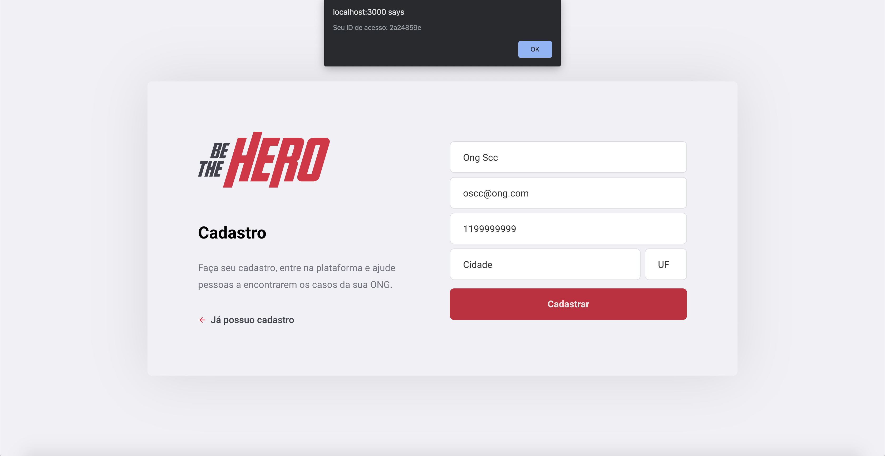

## :rocket: Sobre o projeto

O BeTheHero é uma aplicação web desenvolvida durante a semana OmniStack 11 da RocketSeat.
O intúito da aplicação seria cadastrar ONGs que poderiam registrar, através do frontend web, casos onde necessitariam da ajuda de doadores como, por exemplo, cirurgia para cães atropelados, cirurgia de castração para gatos abandonados, etc. E os doadores poderiam ver a lista desses registros através do frontend mobile e entrar em contato com a ONG caso desejasse ajudar.

Desenvolvemos o Backend em Node.js, a parte web com ReactJS e a parte mobile com React Native.

Todos os registros são salvos em um banco de dados sqlite

## :question: Como rodar o desafio

- Clone o repositório
- Rode o comando `npm install` no `backend`, `frontend` e `mobile` para fazer a instalação das dependencias
- Rode as migrations com o comando `npx knex migrate:latest`

- Para o mobile, vá até a pasta `mobile` e rode o comando `cd ios && pod install && cd..`

- Rode o backend para que o frontend possa fazer as chamadas a API com o comando `npm start` (deve ser executado dentro da pasta backend)

- Rode o frontend com os seguintes comandos:
-- Web `npm start`
-- Mobile `yarn ios` ou `yarn android` (PS: Esta aplicação foi testada somente no iOS)

## :camera:

  
  

